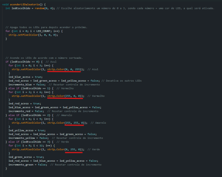

# Cata Bomba

Cata Bomba é uma lixeira interativa que transforma o ato de descartar lixo corretamente em uma experiência divertida e educativa, quase como um jogo. A seguir, iremos mostrar as funcionalidades do código e como manuseá-lo.

---

## Como utilizar o código:

### Bibliotecas necessárias e como instalar:
- **LiquidCrystal I2C**
- **Adafruit NeoPixel**
- **Como instalar as bibliotecas:** Abra a IDE do arduino, clique na aba que possui ícone de livros e escreva a biblioteca que deseja instalar na barra de pesquisas, depois clique em instalar.

---

### Componentes que podem ser alterados e como:

#### 1. **Localização dos pinos**
   - Para modificar a localização dos pinos, altere no Arduino e substitua no código (exemplo: linha 8).
   

#### 2. **Cores dos LEDs**
   - Para alterar as cores dos LEDs, modifique os valores dentro da função `acenderLEDaleatorio()` (linhas 129 até 179).
   - 
   - Cada cor é representada por uma combinação específica de três valores, correspondentes aos componentes RGB (Vermelho, Verde e Azul). 
   - Pesquise os códigos das cores desejadas e substitua os valores dentro da função `strip.Color()`.
   

#### 3. **Associação das cores a sensores e variáveis**
   - Exemplo: A cor vermelha está associada a várias variáveis, como:
     - `leitor_red` (linhas 14 até 17)

       
     - `estado_leitor_red` (linhas 36 até 40)

       
     - `led_red_aceso` (linhas 46 a 49)

       
     - `incremento_red` (linhas 55 a 58)

       
   - Caso altere o nome de alguma variável, atualize todas as instâncias citadas no código. Recomenda-se usar nomes que reflitam claramente as cores às quais as variáveis se referem, para facilitar a manutenção e compreensão do código.

#### 4. **Tempo que os LEDs ficam acesos**
   - Por padrão, os LEDs ficam acesos por 1.5 segundos. Para alterar esse intervalo, modifique o valor dentro da condição `if (tempoAtual - tempoAnterior >= 1500)` (linha 216).

     

--- 

